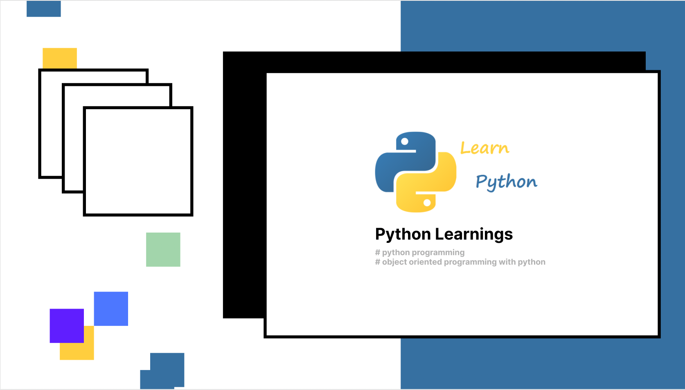

# Python Learnings 🐍

1. Input & Output
2. Formatted output
3. Naming conventions
4. Value assignment
5. LEGB rule
6. Global and nonlocal
7. Data types
8. Type conversion
9. Operators
10. Flow control 1: if else
11. Flow control 2: ternary operator
12. Flow control 3: pass statement
13. Flow control 4: loops
14. Flow control 5: break and continue 
15. Flow control 6: else with for loops
16. Flow control 7: nestead loops
17. Flow control 8: 'in' vs 'in range'
18. String formatting

